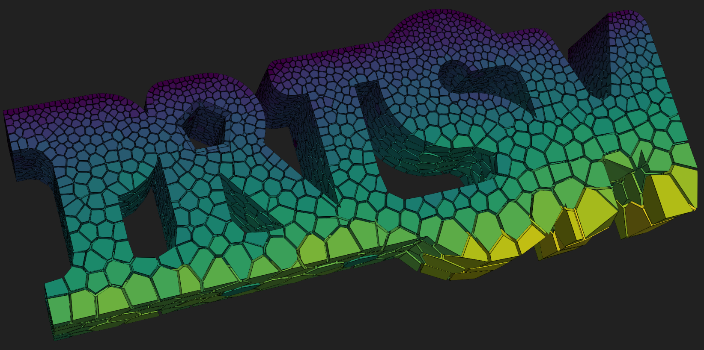
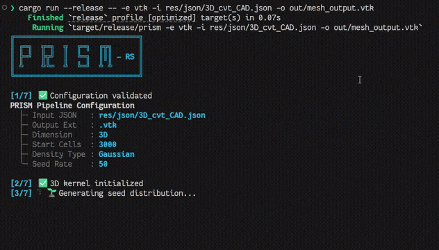
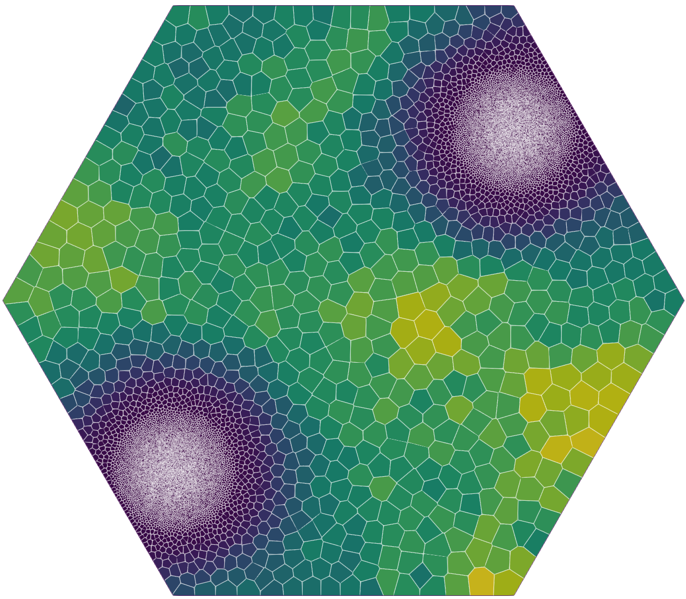
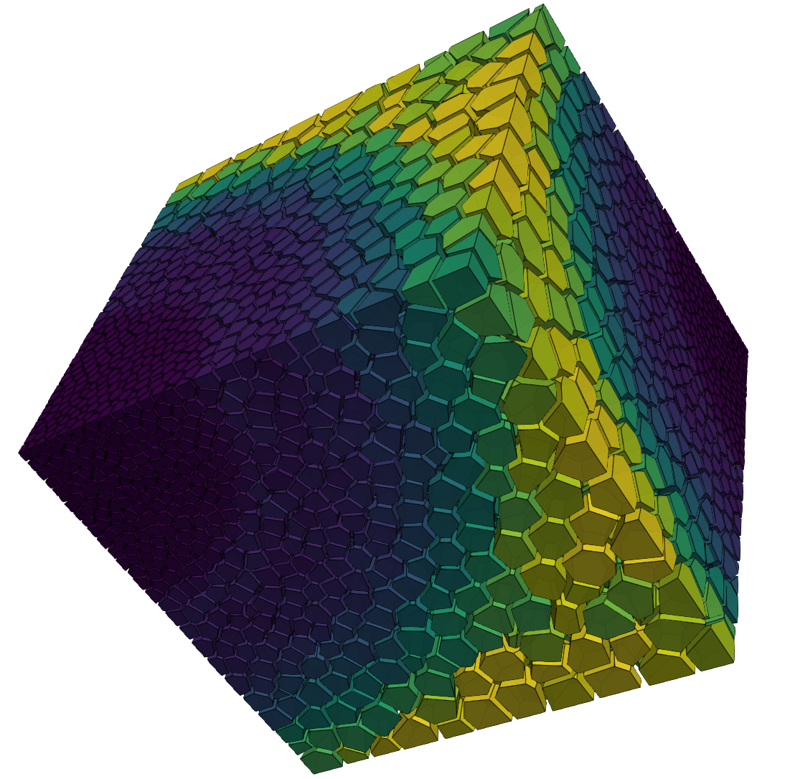
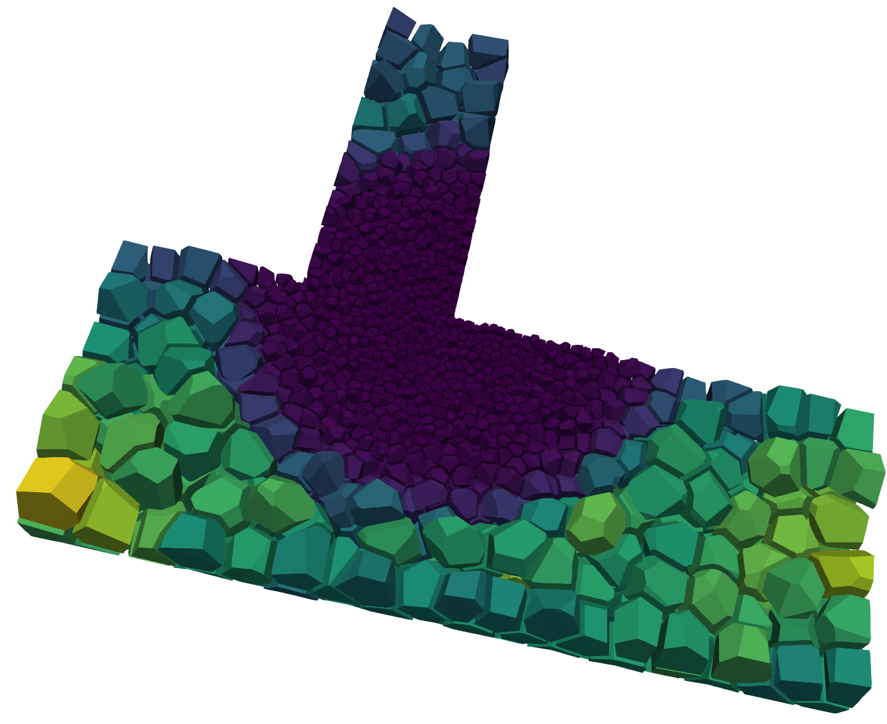
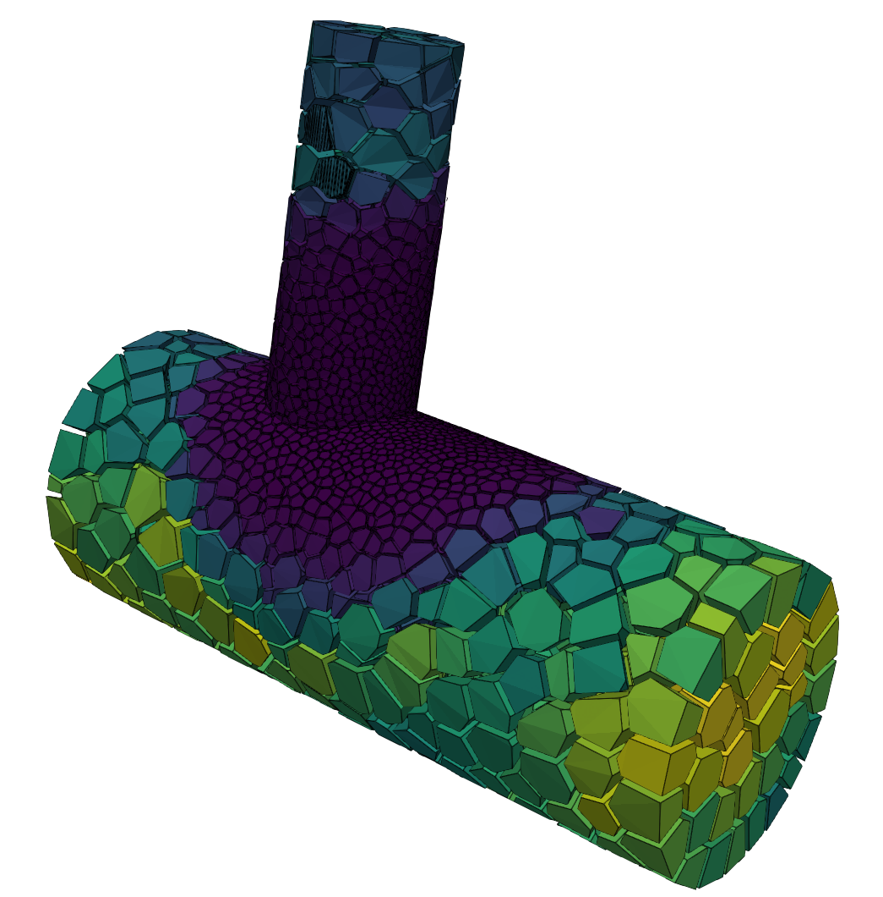

<div align="center">

#  **PRISM-rs** : Adaptive Polytopal Meshing Made Simple

**Rust meshing framework for High-Performance Numerical Simulations**

[](#)
[](#)
[](#)<br>
[](https://opensource.org/licenses/LGPL-2.1)

_A-posteriori & A-priori polytopal meshing for modern numerical solvers with built-in HR-refinement._


<br>
</video>
</div>
<br>

> **💎 Acknowledgement:** Prism-rs relies on the **Geogram** computational geometry library (developed by Bruno Lévy / INRIA) to handle restricted Delaunay triangulations and Voronoi clipping at the C++ FFI boundary.

---

## ✨ Why Prism-rs?

When running complex numerical simulations, mesh quality strictly dictates solver convergence and accuracy. Prism-rs provides a highly controllable, fast, and memory-safe environment to generate adaptive polyhedral meshes.

- **Smart Adaptation:** Dynamically injects seeds and clusters cells in critical domain areas (e.g., boundary layers, shockwaves) based on analytical density fields.
- **Dual-Gate Convergence:** A self-aware state machine actively monitors geometric quality and kinematic energy, automatically adjusting relaxation parameters to prevent topological degradation.
- **Memory-Safe Parallelism:** Orchestrated in zero-cost Rust using Rayon for parallel Lloyd relaxation, while delegating heavy geometric clipping to the battle-tested Geogram C++ kernel.
- **Simulation-Ready:** Features topological self-healing to guarantee closed, convex cells. Exports natively to **VTK** and **MED** formats, with built-in handover to the PANDA CFD solver.

---

## 🛠️ Installation & Headless Build

The PRISM build script automates the complex C++ integration natively within Cargo. You do not need to pre-compile Geogram.

**Prerequisites:**

- Rust Toolchain 1.70+ (via rustup)
- Git (for fetching submodules)
- CMake (v3.10+)
- C++17 Compiler (GCC, Clang, or MSVC)

_The build system automatically rewrites the Geogram CMake configuration to strip out X11/OpenGL and enforce deterministic threading logic, guaranteeing a zero-config compile on any compute cluster._

```bash
git clone [https://github.com/your-repo/Prism-rs.git](https://github.com/your-repo/Prism-rs.git)
cd Prism-rs

# Cargo handles the headless C++ compilation and Rust linking automatically
cargo build --release
```

---

## 🚀 Usage & CLI Arguments

Prism-rs is driven by a lightweight CLI and explicit JSON configuration files.

### Basic Execution

```bash
# Run with the default configuration
cargo run --release

# Run a specific configuration and output to a custom directory
cargo run --release -- -i res/json/2D_adapted_cvt.json -o out/my_custom_mesh -e vtk
```

### Command Line Arguments

| Argument         | Short | Default                        | Description                                                                       |
| :--------------- | :---: | :----------------------------- | :-------------------------------------------------------------------------------- |
| `--input`        | `-i`  | `res/json/2D_adapted_cvt.json` | Path to the JSON configuration file.                                              |
| `--out`          | `-o`  | `out/mesh_output`              | Destination path and filename (without extension).                                |
| `--ext`          | `-e`  | `vtk`                          | Export format. Supports `med` or `vtk`.                                           |
| `--geogram-logs` |       | `false`                        | Un-mutes the internal C++ Geogram logger for deep geometry debugging.             |
| `--sim`          |       | `false`                        | Call the automatic PANDA CFD built-in solver runner launch after mesh generation. |

> Note : `panda-runner` need a `.env` or `export PANDA_MODULES_PATH=path/to/panda/modules`. See more on https://github.com/mohd-afeef-badri/panda

---

## 📊 Convergence Telemetry

Want to see exactly how the convergence optimization is performing? You can enable the internal state machine logging via a simple environment variable.

```bash
PRISM_TELEMETRY=1 cargo run --release -- -i res/json/3D_adapted_cvt.json
```

This dynamically injects a CSV logger into the compute loop, exporting iteration data to `out/log/convergence_metrics.csv`. You can then visualize the convergence behavior (Displacement vs. Aspect Ratio) using the provided Python utility:

```bash
python src/python/plot_convergence.py
```

---

## 🤝 Contributing

Contributions from the computational geometry and numerical simulation communities are highly encouraged! To maintain the stability of the C++ FFI bridge and the mathematical solvers, please ensure all checks pass before submitting a Pull Request:

- **Unit Tests:** Verify the core mathematical operations, geometry healers, and density evaluators.
  ```bash
  cargo test --lib
  ```
- **Integration Tests:** Geogram's C++ memory pool is strictly not thread-safe across isolated FFI boundaries. You must force a single thread for end-to-end integration tests to prevent segmentation faults.
  ```bash
  cargo test --test integration_tests -- --test-threads=1
  ```
- **Examples:** Ensure all provided examples compile and run successfully.
  ```bash
  cargo test --examples
  ```

---

## 📜 License & Authors

**Prism-rs** is developed and maintained by the **French Alternative Energies and Atomic Energy Commission (CEA)**.

This project is released under the **GNU Lesser General Public License v2.1 (LGPL-2.1)**, aligning its distribution and integration model with large-scale scientific ecosystems like SALOME. See the `LICENSE` file for details.

---

## 📸 Gallery

<div align="center">
  
  
  
  

</div>
